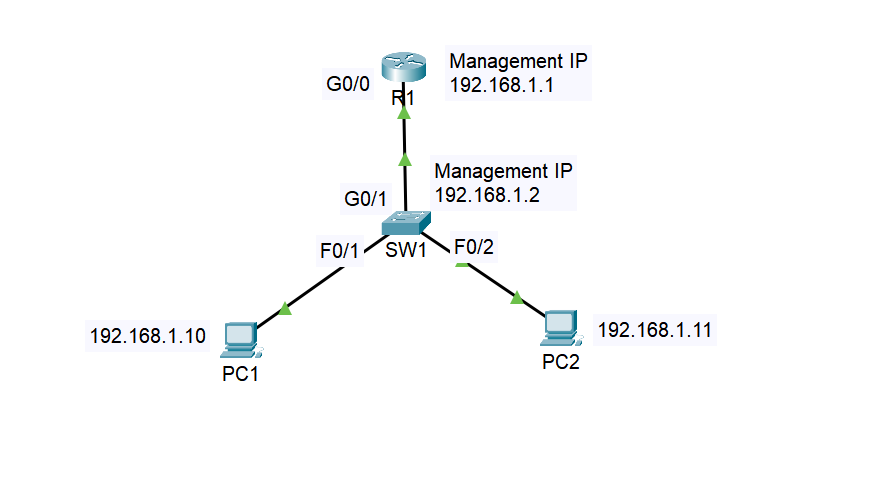

# Lab 01: Basic Device Config & Security Baseline

## Objective

This lab is about getting the basics right before anything else gets layered on top. A router and switch shouldn't go on a network with default settings, so I worked through the fundamentals here: hostnames, a legal banner, encrypted passwords, local accounts instead of a shared login, and SSH as the only way in remotely. Nothing fancy, but it's the baseline every device I touch after this will start from.

## Topology



| Device | Interface | IP Address | Role |
|--------|-----------|------------|------|
| R1 | Gi0/0 | 192.168.1.1/24 | Default gateway |
| SW1 | VLAN 1 (SVI) | 192.168.1.2/24 | Management |
| PC1 | NIC | 192.168.1.10/24 | End host / SSH test client |
| PC2 | NIC | 192.168.1.11/24 | End host |

## Key Concepts

- **Local AAA vs. line passwords**: A plain `line vty` password just authenticates anyone who knows the string. Local AAA (`username ... secret ...` plus `login local`) ties each login to an individual account instead, which is what accountability actually requires.
- **`enable secret` vs. `enable password`**: `enable secret` is hashed (MD5 by default). `enable password` sits in the config in plaintext. I always use `enable secret`, since configuring both just leaves the plaintext one visible and unused, which looks sloppy the moment someone reads the config.
- **Why SSH needs a domain name and an RSA key**: SSH builds its host key from the hostname plus the domain name together. Skip `ip domain-name` and `crypto key generate rsa` either fails silently or prompts you in a way that's confusing the first time you hit it. I learned this one the hard way.
- **`service password-encryption`**: This applies a weak, reversible cipher (type 7) to plaintext passwords in the config. It's not real security, it just stops a password from being read at a glance during a screen share or over someone's shoulder.
- **Two local accounts on SW1**: I set up two separate `username`/`secret` pairs instead of one shared login, so every session ties back to a specific account. That shows up in `show users` and logging output, and it's basically how local AAA is meant to work before you bring in something centralized like RADIUS or TACACS+.
- **Keeping real credentials out of the docs**: Even for a lab, I didn't want actual usernames and passwords sitting in a public repo. What's below uses placeholder values (`netadmin1`, `<strong-password>`) that match the real config structure without exposing anything real.
- **VTY line range, `0 4` vs. `0 15`**: Routers default to `line vty 0 4` (5 sessions) by convention, since usually only one or two people manage a router at once. I used `0 15` on both devices here for consistency. Functionally it doesn't matter as long as `login local` and `transport input ssh` are applied to every line, which I checked with `show line vty`.

## Configuration Steps

### R1, Router

```
enable
configure terminal
hostname R1
enable secret Cisco123!
service password-encryption

banner motd #
Unauthorized access is prohibited. All activity is logged and monitored.
#

ip domain-name ccnalabportfolio
username netadmin1 secret <strong-password>
crypto key generate rsa modulus 1024

line vty 0 15
 login local
 transport input ssh
exit

line console 0
 password <strong-password>
 login
 logging synchronous
exit

interface GigabitEthernet0/0
 ip address 192.168.1.1 255.255.255.0
 no shutdown
exit

end
write memory
```

### SW1, Switch

```
enable
configure terminal
hostname SW1
enable secret Cisco123!
service password-encryption

banner motd #
Unauthorized access is prohibited. All activity is logged and monitored.
#

ip domain-name ccnalabportfolio
username netadmin1 secret <strong-password-1>
username netadmin2 secret <strong-password-2>
crypto key generate rsa modulus 1024

line vty 0 15
 login local
 transport input ssh
exit

line console 0
 password <strong-password>
 login
 logging synchronous
exit

interface vlan 1
 ip address 192.168.1.2 255.255.255.0
 no shutdown
exit

ip default-gateway 192.168.1.1

end
write memory
```

## Verification

**Confirm no Telnet, SSH only:**
```
R1# show line vty
SW1# show line vty
```
The "Input" column should show `ssh` only, never `telnet ssh` or blank.

**Confirm SSH actually works from PC1:**
```
PC1> ssh -l netadmin1 192.168.1.1
Password: <strong-password>
R1#
```

**Confirm password encryption is on:**
```
R1# show running-config | include password
```
Every password line should start with `7 ` (encrypted), never plaintext.

**Confirm the banner shows up before login:**
Disconnect and reconnect over console or SSH. The MOTD banner should appear before the username prompt, every time.

## Troubleshooting Notes

- **`crypto key generate rsa` doesn't prompt, and SSH won't come up**: Almost always means `ip domain-name` wasn't set first, or the hostname is still the default. Set both before generating the key.
- **SSH connects but drops immediately**: Check that `transport input ssh` is actually applied. If it's still `transport input all` or unset, some Packet Tracer versions accept the SSH handshake but then misbehave. Restrict it explicitly.
- **Locked out after `login local` with no username configured**: Create the `username` account first, then apply `login local` to the vty lines. Do it in the wrong order and you can lock yourself out of remote access entirely (console would still work as a fallback in that case).
- **Console lockout from an incomplete `username` command**: This one actually happened to me. `username admin` on its own isn't a complete command, IOS needs a paired password or secret (`username admin secret Cisco123!`). I had a malformed entry, so `login local` was checking against a credential that didn't really exist, and I got locked out of console with no other session open to fall back on. I recovered it with the standard IOS password-recovery procedure: power-cycle the router, break into ROMMON during boot (Ctrl+C), run `confreg 0x2142` then `reset` to skip startup-config authentication on the next boot, skip the setup wizard, `copy startup-config running-config` to load the saved config without triggering the login, fix the `username` line, restore normal boot behavior with `config-register 0x2102`, then save and reload to confirm it actually held.
- **SSH connects but drops you at `R1>` instead of `R1#`, and `enable` says `% No password set`**: This one caught me out after a restart. If a device has no `enable secret` (or `enable password`) configured, IOS won't let a remote session (SSH or Telnet) reach privileged EXEC mode at all, it stops you cold at user EXEC. That's real IOS behavior, not a Packet Tracer bug, it exists so nobody can SSH in and land straight at a privileged prompt with zero enable authentication. Console access can behave differently, but vty sessions can't skip it. The fix is just making sure `enable secret` is actually configured and saved before testing SSH. I checked it with `show running-config | include enable secret`, if that comes back empty, don't bother testing SSH yet, since you'll hit the same wall.
- **`% Bad secrets` error**: This is IOS's generic wrong-password message for anything checked against a hashed secret, whether that's `enable secret` or a `login local` account. Usually it's a case-sensitivity mismatch, a typo, or (like above) a malformed credential rather than an actually wrong password. Run `show running-config | include secret` to confirm what's really configured (you'll see the hash, not the plaintext) before assuming the password itself is the problem.
- **Packet Tracer's RSA modulus**: 1024-bit is the minimum PT will generate without hanging, and some versions get slow above that, so I kept it at 1024 for lab purposes even though production would use 2048 or higher.

## Files

- `lab01.pkt`, Packet Tracer file
- `configs/r1-running-config.txt`, R1 running-config
- `configs/sw1-running-config.txt`, SW1 running-config
- `topology.png`, network diagram
