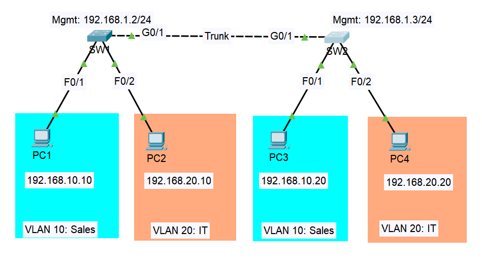

# Lab 02: VLANs & Trunking

## Objective

This lab is about segmenting a flat network into VLANs and making sure two switches can still carry all of them across a single trunk link. I want to show two things: that devices in the same VLAN can reach each other even when they're plugged into different switches, and that devices in different VLANs stay isolated from each other with no router(default gateway) in the picture yet.

## Topology



| Device | Interface    | VLAN       | IP Address       |
| ------ | ------------ | ---------- | ---------------- |
| SW1    | VLAN 1 (SVI) | Management | 192.168.1.2/24   |
| SW2    | VLAN 1 (SVI) | Management | 192.168.1.3/24   |
| PC1    | Fa0/1 on SW1 | 10         | 192.168.10.10/24 |
| PC2    | Fa0/2 on SW1 | 20         | 192.168.20.10/24 |
| PC3    | Fa0/1 on SW2 | 10         | 192.168.10.20/24 |
| PC4    | Fa0/2 on SW2 | 20         | 192.168.20.20/24 |

SW1 and SW2 connect via Gi0/1 on each, configured as a trunk carrying both VLANs plus a dedicated native VLAN.

## Key Concepts

- **Why PC1 and PC3 are on the same VLAN but different switches**: this is the actual test of the lab. If the trunk is working, PC1 (SW1) and PC3 (SW2) should ping each other fine since they're both VLAN 10, even though the traffic has to cross the inter-switch link to get there.
- **Why PC1 shouldn't reach PC2**: they're on different VLANs and there's no router yet to move traffic between them (that's Lab 03). A failed ping here isn't a bug, it's VLAN isolation doing exactly what it's supposed to.
- **`switchport mode access` vs. leaving it default**: by default, switch ports run DTP (Dynamic Trunking Protocol) and can auto-negotiate into a trunk. Explicitly setting access ports to `switchport mode access` turns that off, so nobody can trick a port into trunking just by connecting a device that requests it. Small thing, but it's a real security practice, not just cleanup.
- **Native VLAN, and why I moved it off VLAN 1**: untagged trunk traffic falls into whatever VLAN is set as native. Leaving that as the default VLAN 1 is a known weak spot, since it can be abused for VLAN-hopping attacks. I set the native VLAN to 99 on both ends instead, an unused VLAN with nothing plugged into it, so there's nothing meaningful to hop into even if someone tried.
- **Cable choice, crossover vs. straight-through**: I used a copper cross-over cable for the SW1-SW2 trunk link, and straight-through cables for every PC-to-switch connection. That's not arbitrary. The old rule of thumb is "same device type, use a crossover" (switch-to-switch, PC-to-PC, router-to-router), while "different device type, use a straight-through" (PC-to-switch, switch-to-router). Modern switches actually support Auto-MDIX, which auto-detects and corrects for the wrong cable type, so this distinction matters less in practice than it used to, but I still chose the technically correct cable for each link rather than relying on Auto-MDIX to bail me out, since it's the kind of fundamental most CCNA material still expects you to know cold.
- **Matching native VLANs on both ends of a trunk**: if SW1 and SW2 disagree on which VLAN is native, IOS will actually flag it in the logs as a native VLAN mismatch. It won't necessarily break traffic immediately, but it's a real misconfiguration that shows up in `show interfaces trunk`, so I made sure both sides say 99.

## Configuration Steps

### SW1

```
enable
configure terminal
hostname SW1

vlan 10
 name Sales
vlan 20
 name IT
vlan 99
 name Native
exit

interface FastEthernet0/1
 switchport mode access
 switchport access vlan 10
exit

interface FastEthernet0/2
 switchport mode access
 switchport access vlan 20
exit

interface GigabitEthernet0/1
 switchport mode trunk
 switchport trunk native vlan 99
 switchport trunk allowed vlan 10,20,99
exit

interface vlan 1
 ip address 192.168.1.2 255.255.255.0
 no shutdown
exit

end
write memory
```

### SW2

```
enable
configure terminal
hostname SW2

vlan 10
 name Sales
vlan 20
 name IT
vlan 99
 name Native
exit

interface FastEthernet0/1
 switchport mode access
 switchport access vlan 10
exit

interface FastEthernet0/2
 switchport mode access
 switchport access vlan 20
exit

interface GigabitEthernet0/1
 switchport mode trunk
 switchport trunk native vlan 99
 switchport trunk allowed vlan 10,20,99
exit

interface vlan 1
 ip address 192.168.1.3 255.255.255.0
 no shutdown
exit

end
write memory
```

## Verification

**Confirm VLANs exist and ports are assigned correctly:**

```
SW1# show vlan brief
SW2# show vlan brief
```

Fa0/1 and Fa0/2 should show up under VLAN 10 and VLAN 20 respectively, not still sitting in VLAN 1.

**Confirm the trunk is actually trunking:**

```
SW1# show interfaces trunk
```

Gi0/1 should show up with mode "trunk", native VLAN 99, and VLANs 10, 20, 99 in the allowed list. Run the same on SW2 and confirm both sides agree.

**Prove same-VLAN traffic crosses the trunk:**

```
PC1> ping 192.168.10.20
```

This should succeed, PC1 and PC3 are both VLAN 10, just on different switches.

**Prove different-VLAN traffic is isolated:**

```
PC1> ping 192.168.20.10
```

This should fail. No route exists between VLANs yet, so this confirms isolation is working correctly rather than something being broken.

## Troubleshooting Notes

- **Ping between same-VLAN PCs on different switches fails**: first check `show interfaces trunk` on both switches. If Gi0/1 isn't listed there at all, the port probably never actually became a trunk, usually because `switchport mode trunk` didn't get applied, or DTP negotiated something unexpected. Confirm both ends agree on trunk mode.
- **A VLAN shows up in `show vlan brief` but the port assignment didn't take**: this usually means the VLAN was referenced before it was actually created. Create the VLAN first (`vlan 10`, `name Sales`, `exit`) before assigning any port to it with `switchport access vlan 10`. IOS is forgiving about the order in some versions and less forgiving in others, so I just make it a habit to always create the VLAN first.
- **Native VLAN mismatch warning in the logs**: shows up if SW1 and SW2 don't agree on `switchport trunk native vlan`. Doesn't always break traffic outright, but it's flagged as a real misconfiguration and it's the kind of thing that's easy to overlook if you only configure one side carefully and copy-paste sloppily to the other.
- **Access port still shows VLAN 1 after configuring it**: double check you're on the right interface. It's an easy mistake to `configure terminal` into `FastEthernet0/1` when you meant `0/2`, especially when moving fast between two switches with identical port layouts.

## Files

- `lab02.pkt`, Packet Tracer file
- `configs/sw1-running-config.txt`, SW1 running-config
- `configs/sw2-running-config.txt`, SW2 running-config
- `topology.png`, network diagram
