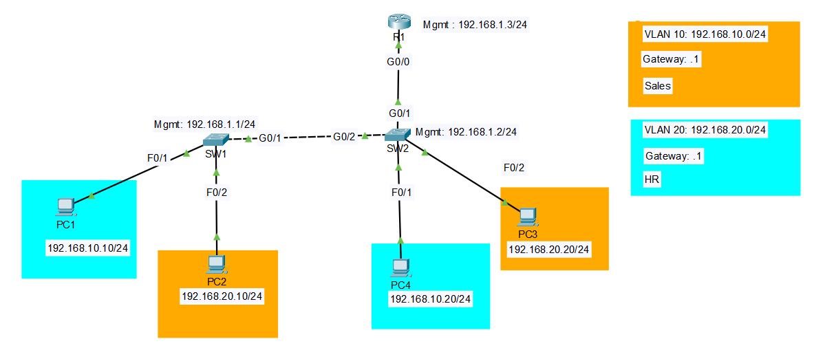

# Lab 03a: Inter-VLAN Routing, Router-on-a-Stick (ROAS)

## Objective

This is the first of two approaches I'm building for inter-VLAN routing, so I can actually compare them side by side rather than just reading about the difference. Here, a single router interface does all the routing between VLANs over one physical trunk link, using subinterfaces instead of one port per VLAN. The goal was to prove that PC1 (VLAN 10) can reach PC3 (VLAN 20), something that was deliberately impossible back in Lab 02, and to do it across a topology where the VLANs are spread across two separate switches, not just one.

## Topology



| Device | Interface | VLAN | IP Address |
|--------|-----------|------|------------|
| R1 | Gi0/0 (trunk, no IP) | — | — |
| R1 | Gi0/0.10 | 10 | 192.168.10.1/24 |
| R1 | Gi0/0.20 | 20 | 192.168.20.1/24 |
| R1 | Gi0/0.100 | 100 (management) | 192.168.1.3/24 |
| SW1 | VLAN 100 (SVI) | Management | 192.168.1.1/24 |
| SW2 | VLAN 100 (SVI) | Management | 192.168.1.2/24 |
| PC1 | Fa0/1 on SW1 | 10 | 192.168.10.10/24 |
| PC2 | Fa0/2 on SW1 | 20 | 192.168.20.10/24 |
| PC4 | Fa0/1 on SW2 | 10 | 192.168.10.20/24 |
| PC3 | Fa0/2 on SW2 | 20 | 192.168.20.20/24 |

SW1 and SW2 connect via a Gi0/1-Gi0/2 trunk. SW2 connects to R1's Gi0/0 over a second trunk. Both trunks carry VLANs 10, 20, and 100, with VLAN 99 set as native (unused, no hosts or SVIs assigned to it).

## Key Concepts

- **Why the router only needs one physical interface**: ROAS splits `Gi0/0` into logical subinterfaces (`.10`, `.20`, `.100`), each tagged for its own VLAN with `encapsulation dot1Q`. The physical interface itself carries no IP address, it's just the trunk. All the actual addressing and routing decisions happen at the subinterface level.
- **Native VLAN and management VLAN are not the same thing, on purpose**: VLAN 99 is native and deliberately unused, its only job is to catch untagged frames and give them nowhere meaningful to go. VLAN 100 is where real management traffic and SVIs actually live. Collapsing these into one VLAN would defeat the reason for having a dedicated native VLAN in the first place.
- **Why the switch SVIs are reachable even though the switches can't route**: SW1 and SW2 are Layer 2 only, they can't move traffic between VLANs themselves. But VLAN 100 reachability doesn't need routing, R1's `Gi0/0.100`, both trunk links, and both SVIs all sit in the same broadcast domain and the same subnet. It's pure Layer 2 forwarding. Cross-VLAN management access (say, a VLAN 10 host reaching a VLAN 100 SVI) would need routing, and that's handled automatically by the same R1 subinterfaces already doing the VLAN 10/20 routing, no extra configuration needed for that specifically.
- **An SVI can show down/down even after `no shutdown`**: this one actually happened to me. A Layer 2 switch's SVI only comes up if at least one active port on that switch is carrying traffic for that VLAN. If the trunk's allowed VLAN list doesn't include the SVI's VLAN, the SVI has nothing to attach to and stays down no matter what. Always check `show interfaces trunk` alongside the SVI status.
- **PCs need a real default gateway now**: unlike Lab 02, where the gateway field was left blank since there was nowhere for VLAN traffic to go, here every PC needs its gateway pointed at R1's matching subinterface IP, or none of this works.

## Configuration Steps

### R1

```
enable
configure terminal
hostname R1

interface GigabitEthernet0/0
 no shutdown
exit

interface GigabitEthernet0/0.10
 encapsulation dot1Q 10
 ip address 192.168.10.1 255.255.255.0
exit

interface GigabitEthernet0/0.20
 encapsulation dot1Q 20
 ip address 192.168.20.1 255.255.255.0
exit

interface GigabitEthernet0/0.100
 encapsulation dot1Q 100
 ip address 192.168.1.3 255.255.255.0
exit

end
write memory
```

### SW1

```
enable
configure terminal
hostname SW1

vlan 10
 name Sales
vlan 20
 name HR
vlan 99
 name Native
vlan 100
 name Management
exit

interface FastEthernet0/1
 switchport mode access
 switchport access vlan 10
exit

interface FastEthernet0/2
 switchport mode access
 switchport access vlan 20
exit

interface GigabitEthernet0/1
 switchport mode trunk
 switchport trunk native vlan 99
 switchport trunk allowed vlan 10,20,99,100
exit

interface vlan 100
 ip address 192.168.1.1 255.255.255.0
 no shutdown
exit

end
write memory
```

### SW2

```
enable
configure terminal
hostname SW2

vlan 10
 name Sales
vlan 20
 name HR
vlan 99
 name Native
vlan 100
 name Management
exit

interface FastEthernet0/1
 switchport mode access
 switchport access vlan 10
exit

interface FastEthernet0/2
 switchport mode access
 switchport access vlan 20
exit

interface GigabitEthernet0/1
 switchport mode trunk
 switchport trunk native vlan 99
 switchport trunk allowed vlan 10,20,99,100
exit

interface GigabitEthernet0/2
 switchport mode trunk
 switchport trunk native vlan 99
 switchport trunk allowed vlan 10,20,99,100
exit

interface vlan 100
 ip address 192.168.1.2 255.255.255.0
 no shutdown
exit

end
write memory
```

## Verification

**Confirm all subinterfaces are up on R1:**
```
R1# show ip interface brief
```
Gi0/0.10, Gi0/0.20, and Gi0/0.100 should all show up/up with their assigned IPs. Gi0/0 itself should show up/up with no IP.

**Confirm VLANs are allowed on every trunk:**
```
show interfaces trunk
```
Run on SW1 and SW2. VLANs 10, 20, and 100 need to appear in the allowed list on every trunk port (SW1-SW2, and SW2-R1), or traffic for that VLAN gets silently dropped partway through the path.

**Confirm R1 can reach both switch management IPs:**
```
R1# ping 192.168.1.1
R1# ping 192.168.1.2
```

**Prove inter-VLAN routing actually works, the main point of this lab:**
```
PC1> ping 192.168.20.20
```
This is PC1 (VLAN 10, on SW1) reaching PC3 (VLAN 20, on SW2), crossing both switches and getting routed by R1 in the middle. A successful reply here is the real proof this lab is working, not just that individual devices are configured correctly in isolation.

## Troubleshooting Notes

- **Ping from a PC to its own default gateway times out**: check the PC's IP settings first (right IP, mask, and gateway, no typos), then confirm the switch access port is actually assigned to the VLAN you think it is with `show vlan brief`.
- **Swapped VLAN assignment across two switches with mirrored port layouts**: this happened to me directly. SW1 and SW2 have identical Fa0/1 and Fa0/2 layouts, but PC3 and PC4 needed opposite VLAN assignments compared to PC1 and PC2. It's an easy mistake to copy the same access-vlan commands across both switches without checking which VLAN actually belongs on which port for that specific switch. `show vlan brief` on both switches, side by side, catches this immediately.
- **A newly added VLAN doesn't reach where it needs to**: whenever a new VLAN is introduced (like VLAN 100 here), it has to be explicitly added to every trunk's allowed list, `switchport trunk allowed vlan add 100` on each trunk port along the path. Creating the VLAN and assigning ports to it isn't enough if the trunks in between are still restricted to the old list.
- **SVI shows down/down despite `no shutdown`**: covered above in Key Concepts, but worth repeating here since it's the kind of thing that looks like a bug until you check `show interfaces trunk` and realize the SVI's VLAN isn't actually reaching that switch yet.

## Files

- `lab03-roas.pkt`, Packet Tracer file
- `configs/r1-running-config.txt`, R1 running-config
- `configs/sw1-running-config.txt`, SW1 running-config
- `configs/sw2-running-config.txt`, SW2 running-config
- `topology.png`, network diagram
