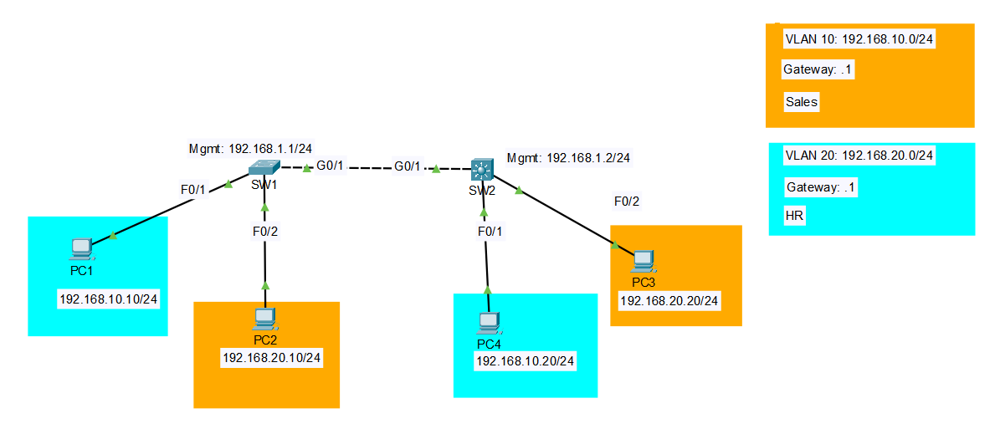

# Lab 03b: Inter-VLAN Routing, SVIs on a Layer 3 Switch

## Objective

This is the second implementation of inter-VLAN routing, built to compare directly against the ROAS version. Same VLANs, same IP addressing, same PCs, but no router anywhere in the topology. Instead, SW2 gets upgraded to a Layer 3 switch and does the routing internally through VLAN interfaces (SVIs). The goal was the same as ROAS: PC1 (VLAN 10) should be able to reach PC3 (VLAN 20), just proven through a different mechanism this time.

## Topology



| Device | Interface | VLAN | IP Address |
|--------|-----------|------|------------|
| SW1 (L2, 2960) | VLAN 100 (SVI) | Management | 192.168.1.1/24 |
| SW2 (L3, 3560) | VLAN 10 (SVI) | Gateway | 192.168.10.1/24 |
| SW2 (L3, 3560) | VLAN 20 (SVI) | Gateway | 192.168.20.1/24 |
| SW2 (L3, 3560) | VLAN 100 (SVI) | Management | 192.168.1.2/24 |
| PC1 | Fa0/1 on SW1 | 10 | 192.168.10.10/24 |
| PC2 | Fa0/2 on SW1 | 20 | 192.168.20.10/24 |
| PC4 | Fa0/1 on SW2 | 10 | 192.168.10.20/24 |
| PC3 | Fa0/2 on SW2 | 20 | 192.168.20.20/24 |

SW1 and SW2 connect via a Gi0/1 trunk, carrying VLANs 10, 20, and 100, with VLAN 99 as native and unused, same convention as every earlier lab.

## Key Concepts

- **No router needed, the switch does its own routing**: SW2 has SVIs for VLAN 10 and VLAN 20, each acting as that VLAN's default gateway directly, no subinterfaces, no separate physical routing device. This is the whole appeal of SVI-based routing at the access or distribution layer, it collapses what ROAS needed two devices for into one.
- **Routing is off by default on a Layer 3 switch, even with SVIs configured**: this is the single biggest gotcha in this lab, and it caught me directly. A router routes by default, no extra command needed. A Layer 3 switch does not, `ip routing` has to be explicitly enabled globally, or every SVI works fine on its own but nothing crosses between VLANs. I could ping each gateway individually and assumed everything was fine, until I actually tried cross-VLAN traffic and it failed.
- **The 3560 needs explicit trunk encapsulation, the 2960 doesn't**: SW1's 2960 only supports 802.1Q, so it never asks. SW2's 3560 supports both 802.1Q and the older ISL, so it defaults to negotiating the encapsulation via DTP, and refuses `switchport mode trunk` until you tell it which encapsulation to actually use with `switchport trunk encapsulation dot1q` first.
- **SW1 still needs an explicit default gateway of its own**: SW1 is pure Layer 2, so its own management traffic can't leave its local subnet without help. `ip default-gateway 192.168.1.2` points it at SW2's management SVI, this is functionally the same role R1's `Gi0/0.100` subinterface played in the ROAS version, just now handled by the L3 switch itself instead of a separate router.

## Configuration Steps

### SW1 (Layer 2, unchanged in role from ROAS)

```
enable
configure terminal
hostname SW1

vlan 10
 name Sales
vlan 20
 name HR
vlan 99
 name Native
vlan 100
 name Management
exit

interface FastEthernet0/1
 switchport mode access
 switchport access vlan 10
exit

interface FastEthernet0/2
 switchport mode access
 switchport access vlan 20
exit

interface GigabitEthernet0/1
 switchport mode trunk
 switchport trunk native vlan 99
 switchport trunk allowed vlan 10,20,99,100
exit

interface vlan 100
 ip address 192.168.1.1 255.255.255.0
 no shutdown
exit

ip default-gateway 192.168.1.2

end
write memory
```

### SW2 (Layer 3, doing the routing)

```
enable
configure terminal
hostname SW2

vlan 10
 name Sales
vlan 20
 name HR
vlan 99
 name Native
vlan 100
 name Management
exit

interface FastEthernet0/1
 switchport mode access
 switchport access vlan 10
exit

interface FastEthernet0/2
 switchport mode access
 switchport access vlan 20
exit

interface GigabitEthernet0/1
 switchport trunk encapsulation dot1q
 switchport mode trunk
 switchport trunk native vlan 99
 switchport trunk allowed vlan 10,20,99,100
exit

ip routing

interface vlan 10
 ip address 192.168.10.1 255.255.255.0
 no shutdown
exit

interface vlan 20
 ip address 192.168.20.1 255.255.255.0
 no shutdown
exit

interface vlan 100
 ip address 192.168.1.2 255.255.255.0
 no shutdown
exit

end
write memory
```

## Verification

**Confirm all SVIs are up on SW2:**
```
SW2# show ip interface brief
```
VLAN 10, VLAN 20, and VLAN 100 interfaces should all show up/up with their assigned IPs.

**Confirm routing is actually active, not just the SVIs existing:**
```
SW2# show ip route
```
Both `192.168.10.0/24` and `192.168.20.0/24` should appear as connected (`C`) routes. If only one shows up, or the command shows almost nothing, `ip routing` likely isn't enabled.

**Confirm SW1 can reach off-subnet destinations through its default gateway:**
```
SW1# ping 192.168.10.1
```

**Prove inter-VLAN routing actually works, the real test:**
```
PC1> ping 192.168.20.20
```
PC1 (VLAN 10, on SW1) reaching PC3 (VLAN 20, on SW2), routed internally by SW2's SVIs. This is the direct equivalent of the ROAS test, same source, same destination, same expected result, different mechanism underneath.

## Troubleshooting Notes

- **`switchport mode trunk` gets rejected with "trunk encapsulation is Auto"**: this is specific to the 3560 (and other switches that support both dot1Q and ISL). Run `switchport trunk encapsulation dot1q` on the interface first, then `switchport mode trunk` will go through. The 2960 never hits this, since it only supports dot1Q and doesn't need to be told.
- **Every SVI pings fine individually, but inter-VLAN traffic still fails**: this means `ip routing` hasn't been enabled globally on the Layer 3 switch. Unlike a router, a Layer 3 switch does not route between VLANs by default even with SVIs fully configured and up. Check `show ip route`, if you only see one VLAN's subnet listed as connected instead of both, that's confirmation.
- **SW1 (or any pure L2 switch in this topology) can't reach anything off its own VLAN**: make sure `ip default-gateway` is set explicitly. A Layer 2 switch has no routing capability of its own, so without this it has no way to send its own management traffic anywhere beyond its local subnet.

## Files

- `lab03-svi.pkt`, Packet Tracer file
- `configs/sw1-running-config.txt`, SW1 running-config
- `configs/sw2-running-config.txt`, SW2 running-config
- `topology.png`, network diagram
