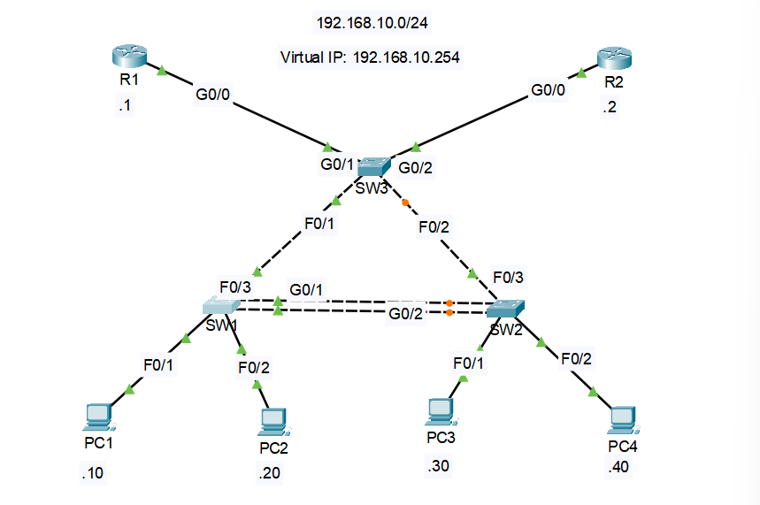

# Lab 04: EtherChannel, STP & HSRP

## Objective

Labs 01 to 03 were about getting connectivity and segmentation right. This one is about what happens when something fails. I built a small network with redundancy at three layers: two switch links bundled into one EtherChannel, Spanning Tree keeping a switch triangle loop-free with a root bridge I chose on purpose, and two routers sharing an HSRP virtual gateway so the PCs keep working if one router goes down.

## Topology



| Device | Interface | IP Address | Role |
|--------|-----------|------------|------|
| R1 | Gi0/0 | 192.168.10.1/24 | HSRP active (priority 110) |
| R2 | Gi0/0 | 192.168.10.2/24 | HSRP standby (priority 100) |
| R1 / R2 | Virtual IP | 192.168.10.254 | PC default gateway |
| SW1 | VLAN 10 (SVI) | 192.168.10.3/24 | STP root bridge |
| SW2 | VLAN 10 (SVI) | 192.168.10.4/24 | Backup root bridge |
| SW3 | VLAN 10 (SVI) | 192.168.10.5/24 | Router-facing switch |
| PC1 | Fa0/1 on SW1 | 192.168.10.10/24 | End host |
| PC2 | Fa0/2 on SW1 | 192.168.10.20/24 | End host |
| PC3 | Fa0/1 on SW2 | 192.168.10.30/24 | End host |
| PC4 | Fa0/2 on SW2 | 192.168.10.40/24 | End host |

| Link | Interfaces |
|------|-----------|
| R1 to SW3 | R1 Gi0/0 to SW3 Gi0/1 |
| R2 to SW3 | R2 Gi0/0 to SW3 Gi0/2 |
| SW3 to SW1 | SW3 Fa0/1 to SW1 Fa0/3 |
| SW3 to SW2 | SW3 Fa0/2 to SW2 Fa0/3 |
| SW1 to SW2 (Po1) | Gi0/1 to Gi0/1 and Gi0/2 to Gi0/2 |

Every PC uses 255.255.255.0 and a default gateway of 192.168.10.254.

## Key Concepts

- **EtherChannel turns two links into one logical link**: without it, two parallel cables between the same pair of switches look like a loop, and STP blocks one of them, so half the bandwidth sits unused. Bundling both into `Po1` with LACP lets STP treat them as a single link and use both. Every member port has to match on speed, duplex, and mode, or the bundle won't form.
- **Why SW1 is the root bridge and not SW3**: SW3 looks like the obvious root because both routers plug into it, but I chose SW1 on purpose. If SW3 were the root, SW1 and SW2 would each reach it over their direct uplinks, the SW1 to SW2 link would lose the election, and `Po1` would end up blocked on one end, carrying nothing. With SW1 as root, SW2 reaches the root over `Po1`, and the link STP blocks is the SW3 to SW2 uplink instead. The trade-off is that while everything is healthy, SW2's traffic to the routers goes the long way through SW1 and SW3. SW2 only uses its direct link to SW3 if `Po1` fails.
- **Setting the priorities instead of trusting the default**: by default the lowest MAC address wins the election, which is arbitrary. SW1 is set to priority 4096 and SW2 to 8192 so the result is predictable, with SW2 taking over as root if SW1 fails. SW3 stays at the default.
- **STP priority is per VLAN**: switches run PVST+ by default, so the priority has to be set for the VLAN carrying the traffic (`spanning-tree vlan 10 priority 4096`). Setting it for VLAN 1 would change nothing for these PCs.
- **PortFast and BPDU Guard only on the PC ports**: PortFast skips the STP listening and learning delay on ports that only ever have an end host. BPDU Guard shuts the port down if a BPDU ever arrives, which would mean someone plugged a switch into a PC port. Neither belongs on the switch-to-switch or router-facing links.
- **HSRP gives the PCs a gateway that survives a router failure**: R1 and R2 share the virtual IP 192.168.10.254, and the PCs only ever point at that address. R1 has the higher priority so it is active, and `preempt` lets it take the role back after it recovers.
- **HSRP does not protect against SW3 failing**: both routers plug into SW3, so if SW3 dies, both are cut off from the LAN no matter how HSRP is configured. HSRP covers a router failure, not a failure of the switch in front of it. A production design would connect the routers to two different switches, but a router can't put two interfaces in the same subnet, so doing that here would need a different addressing plan. I kept the lab focused on the three features it is meant to show.
- **Gigabit ports on the bundle**: a 2960 only has two Gigabit ports. On SW1 and SW2 they go to `Po1`, since that link carries every frame crossing between the two sides. On SW3 they go to the routers, and the uplinks to SW1 and SW2 run at FastEthernet speed.
- **Cable choices**: switch-to-switch links (the SW3 uplinks and both `Po1` members) use cross-over cables, and switch-to-router and switch-to-PC links use straight-through cables.
- **Management IPs on VLAN 10**: earlier labs used a dedicated management VLAN. Here everything is in one VLAN on purpose, to keep the focus on the redundancy features, so the switch SVIs sit in VLAN 10 too.

## Configuration Steps

### R1

```
enable
configure terminal
hostname R1

interface GigabitEthernet0/0
 ip address 192.168.10.1 255.255.255.0
 standby 1 ip 192.168.10.254
 standby 1 priority 110
 standby 1 preempt
 no shutdown
exit

end
write memory
```

### R2

```
enable
configure terminal
hostname R2

interface GigabitEthernet0/0
 ip address 192.168.10.2 255.255.255.0
 standby 1 ip 192.168.10.254
 standby 1 priority 100
 standby 1 preempt
 no shutdown
exit

end
write memory
```

### SW1

```
enable
configure terminal
hostname SW1

vlan 10
 name Users
exit

spanning-tree vlan 10 priority 4096

interface range GigabitEthernet0/1 - 2
 switchport mode access
 switchport access vlan 10
 channel-group 1 mode active
exit

interface port-channel 1
 switchport mode access
 switchport access vlan 10
exit

interface range FastEthernet0/1 - 2
 switchport mode access
 switchport access vlan 10
 spanning-tree portfast
 spanning-tree bpduguard enable
exit

interface FastEthernet0/3
 switchport mode access
 switchport access vlan 10
exit

interface vlan 10
 ip address 192.168.10.3 255.255.255.0
 no shutdown
exit

ip default-gateway 192.168.10.254

end
write memory
```

### SW2

```
enable
configure terminal
hostname SW2

vlan 10
 name Users
exit

spanning-tree vlan 10 priority 8192

interface range GigabitEthernet0/1 - 2
 switchport mode access
 switchport access vlan 10
 channel-group 1 mode active
exit

interface port-channel 1
 switchport mode access
 switchport access vlan 10
exit

interface range FastEthernet0/1 - 2
 switchport mode access
 switchport access vlan 10
 spanning-tree portfast
 spanning-tree bpduguard enable
exit

interface FastEthernet0/3
 switchport mode access
 switchport access vlan 10
exit

interface vlan 10
 ip address 192.168.10.4 255.255.255.0
 no shutdown
exit

ip default-gateway 192.168.10.254

end
write memory
```

### SW3

```
enable
configure terminal
hostname SW3

vlan 10
 name Users
exit

interface range GigabitEthernet0/1 - 2
 switchport mode access
 switchport access vlan 10
exit

interface range FastEthernet0/1 - 2
 switchport mode access
 switchport access vlan 10
exit

interface vlan 10
 ip address 192.168.10.5 255.255.255.0
 no shutdown
exit

ip default-gateway 192.168.10.254

end
write memory
```

## Verification

**Confirm the EtherChannel formed:**
```
SW1# show etherchannel summary
```
`Po1` should show the flags `SU` (Layer 2, in use), with Gi0/1 and Gi0/2 both listed as members with a `P` (bundled). An `I` next to a port means it did not join the bundle.

**Confirm SW1 is the root bridge:**
```
SW1# show spanning-tree vlan 10
```
It should say "This bridge is the root". On SW2 the same command should show `Po1` as the root port.

**Confirm which link STP blocked:**
```
SW3# show spanning-tree vlan 10
```
SW3's root port should be Fa0/1 (toward SW1), and Fa0/2 (toward SW2) should be in the blocking state. That is the one link the triangle gives up to stay loop-free.

**Confirm HSRP roles:**
```
R1# show standby brief
R2# show standby brief
```
R1 should be Active and R2 should be Standby, both showing 192.168.10.254 as the virtual IP.

**Confirm end-to-end connectivity:**
```
PC1> ping 192.168.10.254
PC1> ping 192.168.10.30
```

**Prove HSRP failover works:**
1. Start a continuous ping from PC1 to 192.168.10.254 (`ping -t`).
2. Shut down R1's Gi0/0 (`shutdown`).
3. Run `show standby brief` on R2. It should now show Active, and the ping should recover after a few dropped replies.
4. Bring R1's Gi0/0 back up. Because of `preempt`, R1 should take the Active role back.

**Prove the EtherChannel survives a single link failure:**
1. Start a continuous ping from PC1 to PC3.
2. Shut down SW1's Gi0/1.
3. The ping should keep working over Gi0/2, and `show etherchannel summary` should show Po1 still up with one member.

**Prove STP recovers when the whole bundle fails:**
1. Start a continuous ping from PC1 to PC3.
2. Shut down `Po1` on SW1 (`interface port-channel 1`, then `shutdown`).
3. SW3's blocked port (Fa0/2) should move to forwarding, and the ping should recover through SW3 after STP reconverges, which takes a while under PVST+.

## Troubleshooting Notes

- **Two ports turned orange in Packet Tracer**: one was on SW3's link toward SW2, and the other was one of the two parallel links between SW1 and SW2 before I configured the EtherChannel. Both were STP doing its job. The SW3 to SW2 port is the link the triangle blocks by design, and the parallel port cleared once both cables were bundled into `Po1`.
- **The STP priority appears to do nothing**: check that it was set for the right VLAN. Priority is per VLAN under PVST+, so `spanning-tree vlan 10 priority 4096` is what affects VLAN 10 traffic.
- **A port refuses to join the channel group**: the member ports must match on speed, duplex, and switchport mode, and both ends must agree on the negotiation mode (`active` on both sides works for LACP). Check `show etherchannel summary` for ports flagged `I`.
- **The root bridge ends up somewhere unexpected**: if the priorities aren't set, the switch with the lowest MAC address wins. Confirm with `show spanning-tree vlan 10` on each switch, and check that SW3 is still at the default priority.

## Files

- `lab04.pkt`, Packet Tracer file
- `configs/r1-running-config.txt`, R1 running-config
- `configs/r2-running-config.txt`, R2 running-config
- `configs/sw1-running-config.txt`, SW1 running-config
- `configs/sw2-running-config.txt`, SW2 running-config
- `configs/sw3-running-config.txt`, SW3 running-config
- `topology.png`, network diagram
