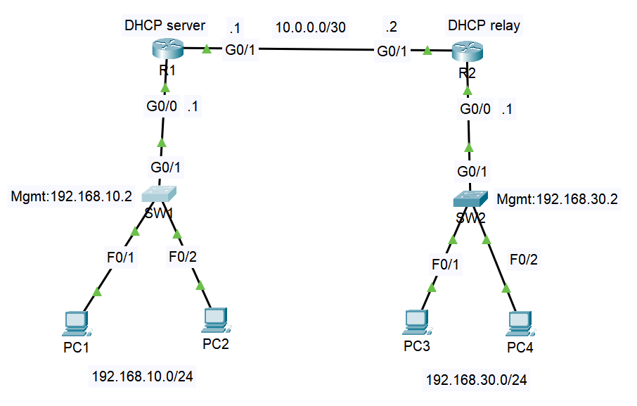

# Lab 05: DHCP & DHCP Snooping

## Objective

Up to this point every PC had a hand-typed address. This lab replaces that with DHCP and then locks it down. R1 acts as the DHCP server for two subnets, R2 relays requests from its own LAN back to R1 so it doesn't need a server of its own, and both access switches run DHCP snooping so only the router uplink is allowed to answer a DHCP request. The goal was to get leases working for clients on both sides of the network, including the ones that have to be relayed, and to understand what each piece is doing rather than just copying the commands.

## Topology



| Device | Interface | IP Address | Role |
|--------|-----------|------------|------|
| R1 | Gi0/0 | 192.168.10.1/24 | LAN1 gateway |
| R1 | Gi0/1 | 10.0.0.1/30 | Transit link to R2 |
| R2 | Gi0/0 | 192.168.30.1/24 | LAN2 gateway, relay agent |
| R2 | Gi0/1 | 10.0.0.2/30 | Transit link to R1 |
| SW1 | VLAN 1 (SVI) | 192.168.10.2/24 | Management |
| SW2 | VLAN 1 (SVI) | 192.168.30.2/24 | Management |
| PC1, PC2 | DHCP | 192.168.10.0/24 | Clients served directly by R1 |
| PC3, PC4 | DHCP | 192.168.30.0/24 | Clients served by R1 through R2's relay |

| Link | Interfaces |
|------|-----------|
| R1 to SW1 | R1 Gi0/0 to SW1 Gi0/1 |
| R2 to SW2 | R2 Gi0/0 to SW2 Gi0/1 |
| R1 to R2 | R1 Gi0/1 to R2 Gi0/1 |
| PC1, PC2 | SW1 Fa0/1, Fa0/2 |
| PC3, PC4 | SW2 Fa0/1, Fa0/2 |

## Key Concepts

- **How a lease actually happens**: a client with no address broadcasts a Discover, the server answers with an Offer, the client sends a Request for that offer, and the server finishes with an Acknowledgment. All of that starts as a broadcast, which is why the router sitting on the client's subnet matters so much.
- **Exclusions keep the pool away from static addresses**: `ip dhcp excluded-address` removes a range from what the server can hand out. I excluded .1 through .9 on both subnets so the gateways and any static devices can never collide with a lease.
- **Why R2 needs a relay**: routers don't forward broadcasts, so a Discover from PC3 would die at R2. `ip helper-address 10.0.0.1` on R2's LAN interface tells it to turn that broadcast into a unicast and send it to R1, stamping its own LAN address (192.168.30.1) into the packet as the relay address. That address is how R1 knows which pool to use.
- **The DHCP server needs a route back to the relay's subnet**: R1 sends its Offer to the relay address, 192.168.30.1. R1 is only directly connected to 192.168.10.0/24 and the transit link, so without a route to 192.168.30.0/24 the Offer gets dropped and the clients on that side just time out. A static route on R1 through R2 fixes it. Lab 06 replaces static routes with OSPF.
- **Snooping trusts the uplink and nothing else**: with `ip dhcp snooping` on, every port is untrusted by default, and an untrusted port is not allowed to send server-style DHCP messages (Offers and Acknowledgments). Marking only the router-facing port as trusted means a rogue DHCP server plugged into a PC port gets its Offers dropped by the switch.
- **The snooping binding table**: as leases are granted, the switch records which MAC got which IP on which port. That table is what later features like Dynamic ARP Inspection build on.
- **Option 82 can break things**: with snooping on, the switch can insert relay information (option 82) into requests it forwards. Some routers reject a request that carries it without a relay address, which looks like DHCP simply failing. `no ip dhcp snooping information option` turns that insertion off.
- **PC1 to PC3 won't ping yet, and that's expected**: R2 has no route back to 192.168.10.0/24, so only the DHCP path works across the transit link. Full reachability arrives with OSPF in Lab 06.
- **DHCP snooping is enabled for VLAN 1 here**: the PCs and the switch SVIs are in the default VLAN in this lab to keep the focus on DHCP. That's a deliberate simplification compared with the VLAN design in Labs 02 to 04.

## Configuration Steps

### R1 (DHCP server)

```
enable
configure terminal
hostname R1

interface GigabitEthernet0/0
 ip address 192.168.10.1 255.255.255.0
 no shutdown
exit

interface GigabitEthernet0/1
 ip address 10.0.0.1 255.255.255.252
 no shutdown
exit

ip route 192.168.30.0 255.255.255.0 10.0.0.2

ip dhcp excluded-address 192.168.10.1 192.168.10.9
ip dhcp excluded-address 192.168.30.1 192.168.30.9

ip dhcp pool LAN1
 network 192.168.10.0 255.255.255.0
 default-router 192.168.10.1
 dns-server 8.8.8.8
exit

ip dhcp pool LAN2
 network 192.168.30.0 255.255.255.0
 default-router 192.168.30.1
 dns-server 8.8.8.8
exit

end
write memory
```

### R2 (relay agent)

```
enable
configure terminal
hostname R2

interface GigabitEthernet0/0
 ip address 192.168.30.1 255.255.255.0
 ip helper-address 10.0.0.1
 no shutdown
exit

interface GigabitEthernet0/1
 ip address 10.0.0.2 255.255.255.252
 no shutdown
exit

end
write memory
```

### SW1

```
enable
configure terminal
hostname SW1

ip dhcp snooping
ip dhcp snooping vlan 1
no ip dhcp snooping information option

interface GigabitEthernet0/1
 ip dhcp snooping trust
exit

interface vlan 1
 ip address 192.168.10.2 255.255.255.0
 no shutdown
exit

ip default-gateway 192.168.10.1

end
write memory
```

### SW2

```
enable
configure terminal
hostname SW2

ip dhcp snooping
ip dhcp snooping vlan 1
no ip dhcp snooping information option

interface GigabitEthernet0/1
 ip dhcp snooping trust
exit

interface vlan 1
 ip address 192.168.30.2 255.255.255.0
 no shutdown
exit

ip default-gateway 192.168.30.1

end
write memory
```

Set PC1 to PC4 to DHCP in their IP configuration.

## Verification

**Confirm all four clients got leases:**
```
R1# show ip dhcp binding
```
PC1 and PC2 should hold addresses in 192.168.10.x starting at .10. PC3 and PC4 should hold addresses in 192.168.30.x starting at .10, which proves the relay path works.

**Confirm the pools and the exclusions:**
```
R1# show ip dhcp pool
```
Each pool should show its network, the default router, and the number of leased addresses.

**Confirm snooping is on and the uplink is trusted:**
```
SW1# show ip dhcp snooping
```
It should list VLAN 1 as enabled, with Gi0/1 trusted and the PC-facing ports untrusted.

**Confirm the switch recorded the leases:**
```
SW1# show ip dhcp snooping binding
```
You should see the MAC, IP, and port for each client on that switch.

**Confirm on the clients:**
```
PC1> ipconfig
```
The address, mask, gateway, and DNS server should all match the pool.

**Optional: prove snooping blocks a rogue server.** Plug a spare router or server into an untrusted PC port, give it its own DHCP pool, set a PC to DHCP, and confirm the PC still takes its address from R1 instead. On the switch, `show ip dhcp snooping statistics` will count the dropped packets.

## Troubleshooting Notes

- **PC3 and PC4 failed while PC1 and PC2 worked**: the clients on R2's side timed out because R1 had no route to 192.168.30.0/24. The relay delivered the request fine, but R1 couldn't send the Offer back to the relay address. Adding `ip route 192.168.30.0 255.255.255.0 10.0.0.2` on R1 fixed it.
- **Clients behind a snooping switch show "DHCP failed"**: temporarily disable snooping with `no ip dhcp snooping` and retry the client. If it gets a lease, the cause is snooping's option 82 insertion, and `no ip dhcp snooping information option` on the switch resolves it while keeping the trust checks.
- **A relay doesn't seem to do anything**: `ip helper-address` goes on the interface facing the clients, not the interface facing the server, and it points at the DHCP server's address (10.0.0.1 here).
- **A lease lands on an address that should be reserved**: check that `ip dhcp excluded-address` covers the gateway and any static devices, and that it's configured for both subnets.

## Files

- `lab05.pkt`, Packet Tracer file
- `configs/r1-running-config.txt`, R1 running-config
- `configs/r2-running-config.txt`, R2 running-config
- `configs/sw1-running-config.txt`, SW1 running-config
- `configs/sw2-running-config.txt`, SW2 running-config
- `topology.png`, network diagram
